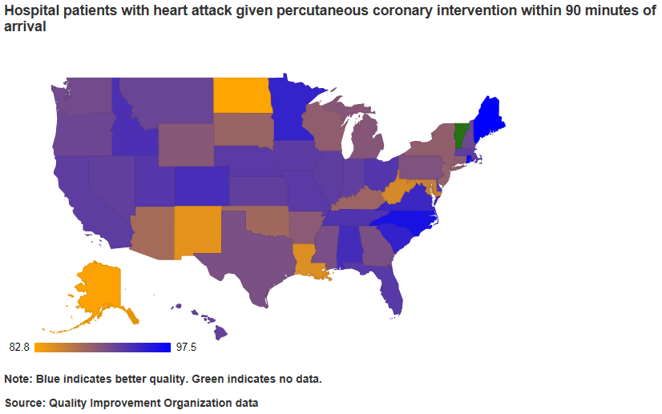

## Read-And-Delete

1. Edit YAML front matter
2. Write using R Markdown
3. Use an empty line followed by three dashes to separate slides!

--- .class #id 

## Afraid you might wind up in the wrong hospital?

  <br>
    <center></center>

---

## Hospitals vary in quality from State to State
```{r echo=FALSE}
qiostate <- read.csv("qioqist.csv")
require(rCharts)
qiostate = as.data.frame(qiostate)
r2 <- rPlot(HeartAttackPCI ~ ST, 
           data=qiostate, type="bar")
r2$addControls('y', 'HeartAttackPCI', names(qiostate))
r2$save('r2.html', cdn = TRUE)
```
<iframe src = "r2.html"></iframe>

---

## Correlations across measures of quality are not great
```{r echo=FALSE}
qiostate <- read.csv("qioqist.csv")
require(rCharts)
qiostate = as.data.frame(qiostate)
r3 <- rPlot(HeartAttackPCI ~ HeartFailureACE, 
           data=qiostate, type="point")
r3$addControls('x', 'HeartAttackPCI', names(qiostate))
r3$addControls('y', 'HeartFailureACE', names(qiostate))
r3$save('r3.html', cdn = TRUE)
```
<iframe src = "r3.html"></iframe>

--- 

## Use Hospital Quality Measures by State to survive your next hospitalization!
<a href="https://emoyusa.shinyapps.io/qiostate/"></a>

For whatever ails you, 

find States with

1. Better processes of care

2. Lower rates of death

3. Lower rates of adverse events

