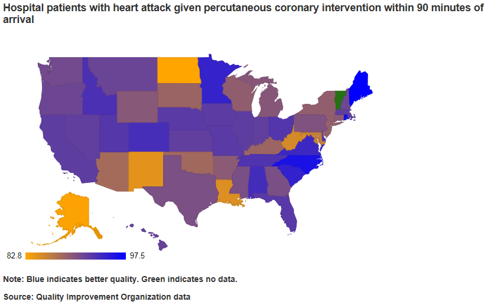

## Read-And-Delete

1. Edit YAML front matter
2. Write using R Markdown
3. Use an empty line followed by three dashes to separate slides!

--- .class #id 

## Afraid you might wind up in the wrong hospital?

   
    

---

## Hospitals vary in quality from State to State

<iframe src = "r2.html"></iframe>

---

## Correlations across measures of quality are not great

<iframe src = "r3.html"></iframe>

--- 

## Use Hospital Quality Measures by State to survive your next hospitalization!

For whatever ails you, 

find States with

1. Better processes of care

2. Lower rates of death

3. Lower rates of adverse events

